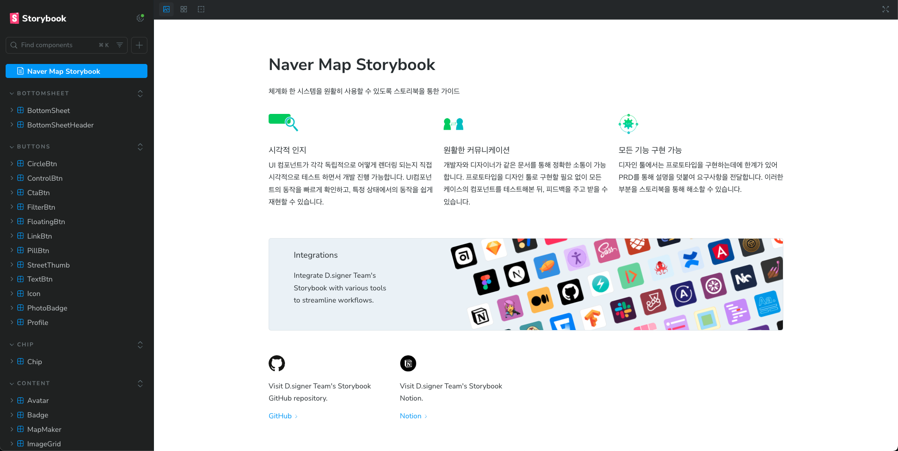

# Naver Map Storybook

 </img>

**Naver Map Storybook**은 네이버 지도 기반의 UI 컴포넌트를  
아토믹 디자인 패턴으로 설계하고 컴포넌트 주도 개발 방식으로 구현한 *학습 목적의 실습 프로젝트*입니다.

 

  <a href="https://www.naver-map-storybook.site" target="_blank">
    🔗 배포 링크
  </a>

 

## 미리 보기

 </img>
